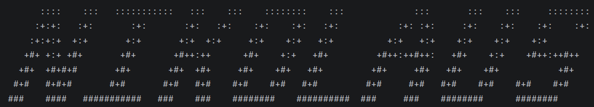

# Nikolaus User Guide

Nikolaus is a **Interactive Task Organisation program** that **keeps track of different types of tasks**
to help you **stay organised and productive**, optimised for use via a **Command Line Interface (CLI)**.

---
## [Features](#Features) Table of Contents
+ [Listing out tasks: `list`](#listing-out-tasks-list)
+ [Adding a todo: `todo`](#adding-a-todo-todo)
+ [Adding a deadline: `deadline`](#adding-a-deadline-deadline)
+ [Adding an event: `event`](#adding-an-event-event)
+ [Marking a task: `mark`](#marking-a-task-mark)
+ [Unmarking a task: `unmark`](#unmarking-a-task-unmark)
+ [Deletes a task: `delete`](#deletes-a-task-delete)
+ [Finds a task: `find`](#finds-a-task-find)
+ [Exits program: `bye`](#exits-program-bye)
+ [Saving task list data](#saving-task-list-data)
+ [Loading task list data](#loading-task-list-data)
+ [Editing task list data](#editing-task-list-data)

---
## Features
> [!NOTE]
> ### **Command Formatting:**
> + Words in `UPPER_CASE` are the parameters to be supplied by the user.  
    These parameters **MUST** be filled in.  
    e.g. in `todo DESCRIPTION`,  
    ✅ `todo read a book`  
    ❌ `todo`  
     
> + Parameters in the format `/type UPPER_CASE` require a space after the `/type` clause.  
    e.g. in `deadline DESCRIPTION /by BY_DATE_TIME`  
    ✅ `deadline tutorial /by 2359 Sunday`  
    ❌ `deadline tutorial /by2359 Sunday`  
     
> + Parameters must be entered in the order they are shown.   
    e.g. in `event DESCRIPTION /from FROM_DATE_TIME /to TO_DATE_TIME`  
    ✅ `event Reading Club /from 2000 Friday /to 2300 Friday`  
    ❌ `event /from 2000 Friday Reading Club /to 2300 Friday`  
     
> + Parameters that are numbers must be written in numerical form not spelled out.  
    e.g in `mark TASK_INDEX`  
    ✅ `mark 2`  
    ❌ `mark two`  
     
> + Commands that do not take in parameters will ignore any parameter provided.  
    Such commands include `list` and `bye`.  
    e.g. in `list hi 23879` will be interpreted as `list`  
     

   

### Listing out tasks: `list`
Shows all tasks in current task list.  

Format: `list`

 

### Adding a todo: `todo`
Adds a todo type task to current task list.  
+ Todos are tasks with a description.

Format: `todo DESCRIPTION`

 

### Adding a deadline: `deadline`
Adds a deadline type task to current task list.  
+ Deadlines are tasks with a description and a by date/time.

Format: `deadline DESCRIPTION /by BY_DATE_TIME`

 

### Adding an event: `event`
Adds an event type task to current task list.  
+ Events are tasks with a description, a from date/time, and a to date/time.

Format: `event DESCRIPTION /from FROM_DATE_TIME /to TO_DATE_TIME`

 

### Marking a task: `mark`
Marks a task in the task list as completed.

Format: `mark TASK_INDEX`
+ `TASK_INDEX` refers to index of task shown in the task list
+ `TASK_INDEX` is an integer.

 

### Unmarking a task: `unmark`
Unmarks a task in the task list as incomplete.

Format: `unmark TASK_INDEX`
+ `TASK_INDEX` refers to index of task shown in the task list
+ `TASK_INDEX` is an integer.

 

### Deletes a task: `delete`
Deletes a task in the task list.

Format: `delete TASK_INDEX`
+ `TASK_INDEX` refers to index of task shown in the task list
+ `TASK_INDEX` is an integer.

 

### Finds a task: `find`
Finds a task from the task list.

Format: `find KEYWORD`
+ The search is case-insensitive. e.g `read` will match `Read`.
+ Only the description is searched.
+ Only allows 1 keyword.

 

### Exits program: `bye`
Exits the program.

Format: `bye`

 

### Saving task list data
TaskList data is saved in the hard disk automatically after any command that changes the data.
There is no need to save manually.

 

### Loading task list data
Any previously saved TaskList data in the hard disk will be loaded automatically when program starts.
There is no need to load manually.

 

### Editing task list data
TaskList data is stored as a text file `[JAR file location]/data/nikolaus.txt`.
Advanced users are welcome to update data directly by editing that data file.

> [!WARNING]  
> If changes made to text file make its format invalid, Nikolaus will ignore all corrupted lines.  
> Corrupted tasks will be reported to the terminal will a description of the error.  
> Edit the data only if you are confident that you can update it correctly.